# AliExpress  E-commerce / (aliexpress- E-commerce)

### Learn how to build this!

If you'd like a step by step guide on how to build this just **CLICK THE IMAGE BELOW**


## ✅ App Setup (localhost)

### 📌 Функциональные требования

#### 👤 Пользовательская часть

- [x] Регистрация и авторизация
  - [x] Возможность регистрации с указанием ФИО, адреса, номера телефона, логина и пароля
  - [x] Поддержка авторизации с использованием Supabase Auth
  - [ ] Верификация по SMS не обязательна, указывается только номер телефона при регистрации

- [ ] Личный кабинет
  - [ ] Отображение баланса, рейтинга
  - [x] История покупок и транзакций
  - [ ] Запрос на вывод средств
  - [ ] Просмотр статусов заказов (в обработке, отправлено, доставлено)
  - [ ] Видимость баллов репутации и количества сделок
  - [x] Возможность изменять уровень аккаунта

- [x] Каталог товаров
  - [x] Просмотр товаров по категориям
  - [x] Поиск товаров по названию и фильтры по различным параметрам
  - [x] Детальная информация о товаре: фото, описание, отзывы

- [x] Корзина и оформление заказа
  - [x] Добавление товаров в корзину
  - [x] Оформление с выбором адреса доставки и оплаты
  - [x] Подтверждение заказа и уведомления

- [ ] Переработка товаров (Обратный выкуп)
  - [ ] Отправка товара на переработку после покупки
  - [ ] Индикация статуса переработки
  - [ ] Начисление средств на баланс после подтверждения

---

#### 🛠 Административная панель

- [x] Управление пользователями
  - [x] Поиск, фильтрация
  - [ ] Изменение баланса, рейтинга, имени
  - [ ] Блокировка и разблокировка
  - [x] Удаление аккаунтов

- [x] Управление товарами
  - [x] Добавление/редактирование
  - [ ] Управление запасами
  - [ ] Импорт с AliExpress
  - [ ] Генерация предложения по выкупу

- [ ] Обработка заказов
  - [ ] Список заказов, статусы
  - [ ] Возвраты и переработка
  - [ ] Ручное добавление возвратов и бонусов
  - [ ] Активность клиента

- [ ] Финансовые операции
  - [ ] Запросы на вывод
  - [x] Инфо об аккаунте + подтверждение
  - [ ] Бонусы и баллы
  - [ ] История транзакций

- [ ] Статистика и отчеты
  - [ ] Генерация отчётов
  - [ ] Просмотр метрик: выручка, заказы, активность

---

#### 🤝 Реферальная система

- [x] Базовая система

- [ ] Управление ссылками
  - [ ] Генерация ссылок
  - [ ] Отслеживание регистраций и активности

- [x] Менеджерские функции
  - [ ] Просмотр клиентов
  - [ ] Изменение баланса, баллов
  - [ ] Блокировка, управление
  - [ ] Вкладка "Редактирование товаров"


### 📲 Поддержка PWA (Progressive Web App)

Проект реализует функциональность PWA — "прогрессивного веб-приложения", что позволяет:

- 📥 Устанавливать сайт как приложение на главный экран устройства (Android, iOS, Desktop)
- ⚡ Быстрый офлайн-доступ за счёт кэширования через Service Worker
- 🚀 Мгновенные загрузки страниц и высокая производительность
- 🔔 Поддержка push-уведомлений (при необходимости)
- 🖥 Идентичный UX как у нативных мобильных приложений

#### 🧪 Технологии и реализация:
- `@vite-pwa/nuxt` или аналогичный модуль
- Манифест приложения: `manifest.webmanifest`
- Service Worker с автообновлением

✅ Позволяет превратить сайт в удобное и автономное приложение прямо из браузера.

## App Setup (localhost)

```
git clone https://github.com/Xatiko540/aliexpress--E-commerce

cp .env.env

npm i

npm install

npm install --legacy-peer-deps

npx prisma generate

pm2 start ecosystem.config.js

npm run build

pm2 status

pm2 restart aliwebb --update-env

npx prisma studio --hostname=0.0.0.0 --port=5558
```

You'll have to setup a Supabase account & Stripe account, then add all of the details in to your .env file.

Once you've connected your application to Supabase. You'll also need to setup the Auth Providers:
    Google [Google](https://cloud.google.com)
    Github [Github](https://github.com/settings/developers)
    
    https://supabase.com/docs/guides/auth/social-login/auth-google
    https://supabase.com/docs/guides/auth/social-login/auth-github
    
Now run the command to migrate your database tables and run your seed file.
    
```
npx prisma migrate dev --name init
```

You should be good to go! If you need any more help, take a look at the tutorial video by clicking the image above.

# Application Images


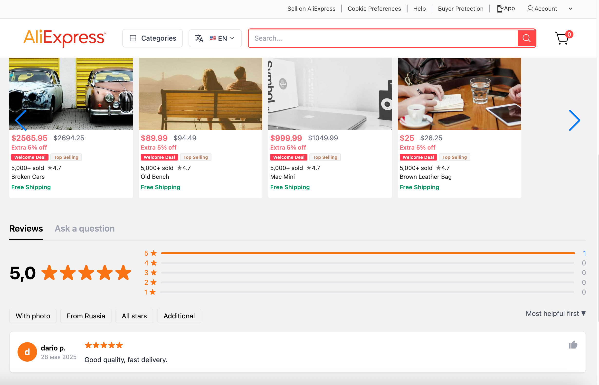

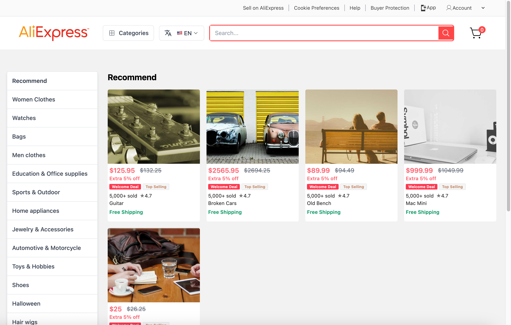

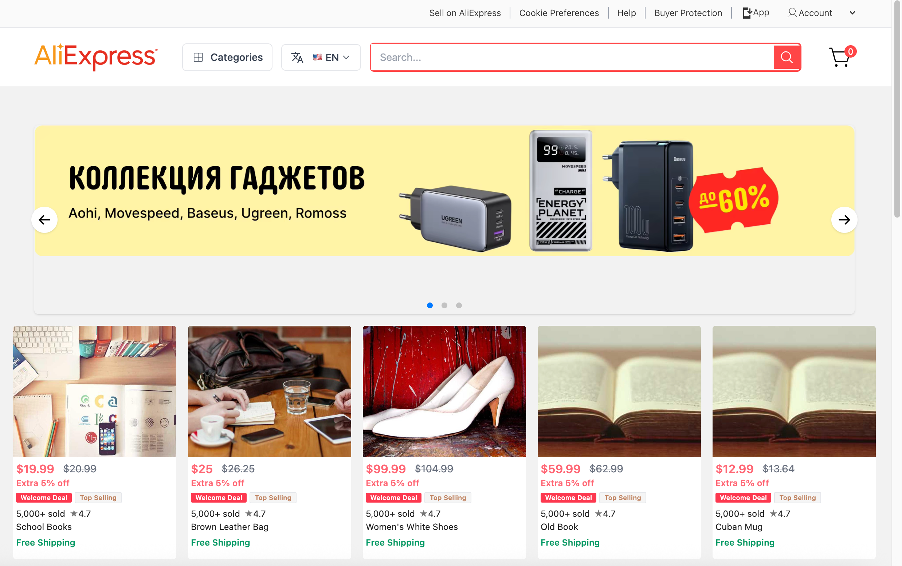

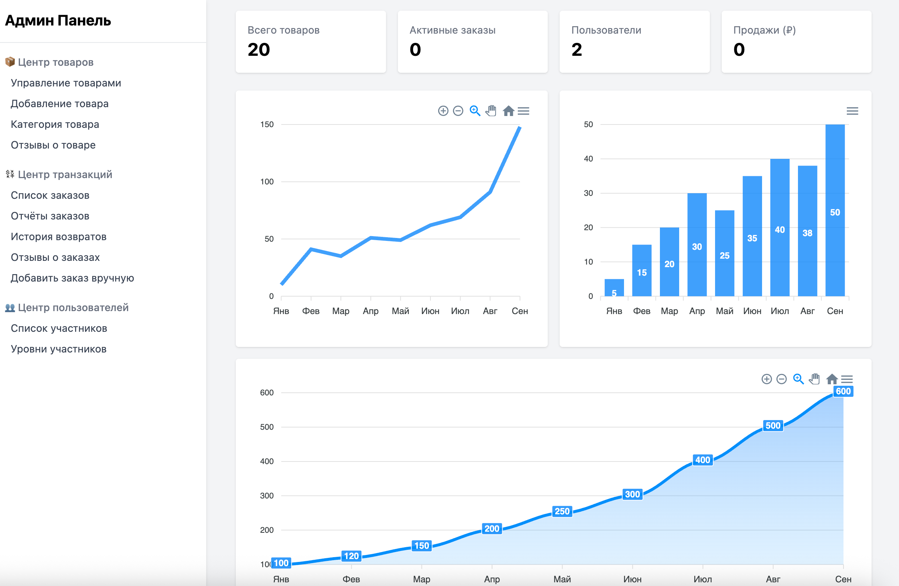

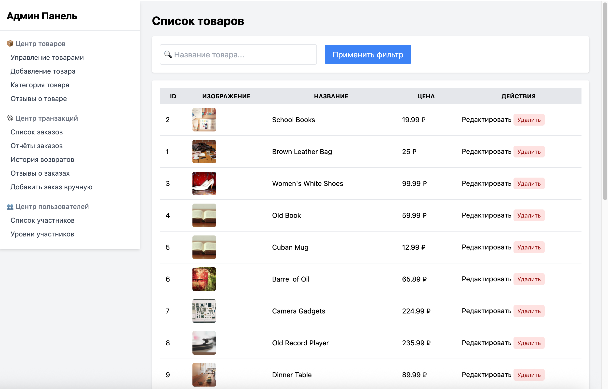

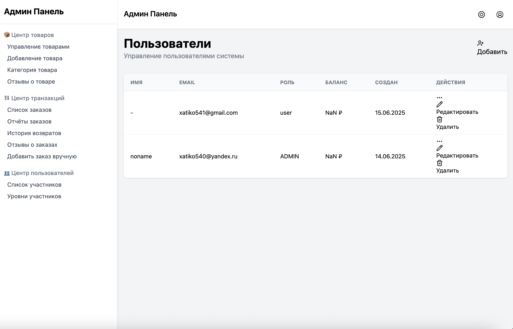

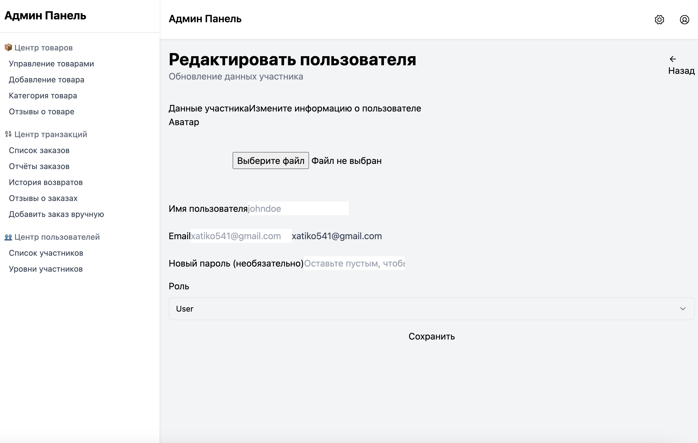

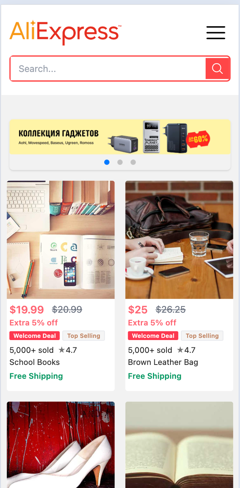

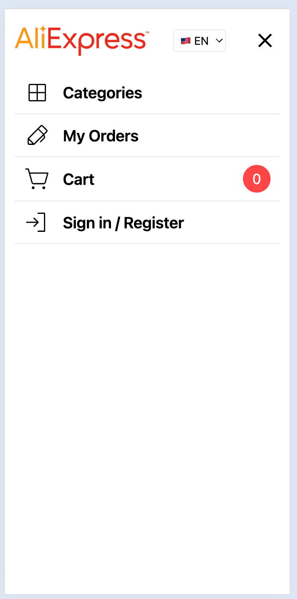

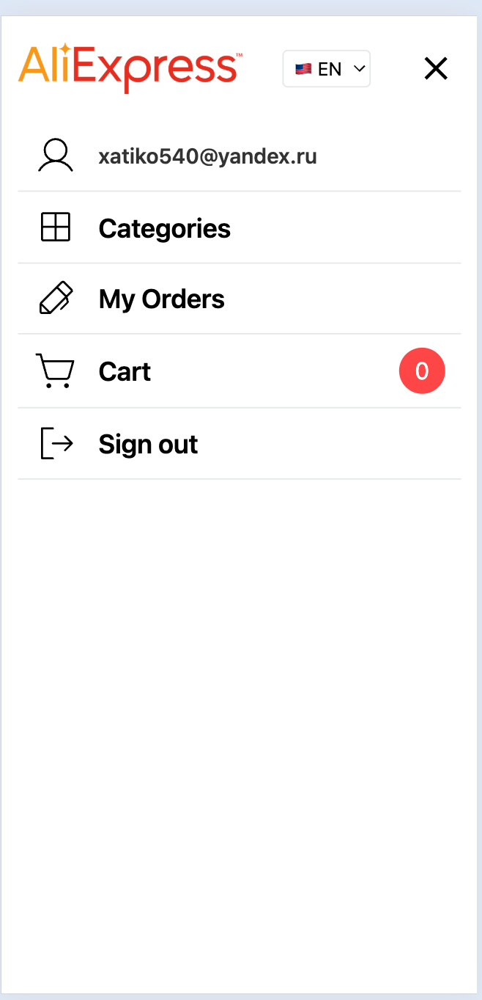

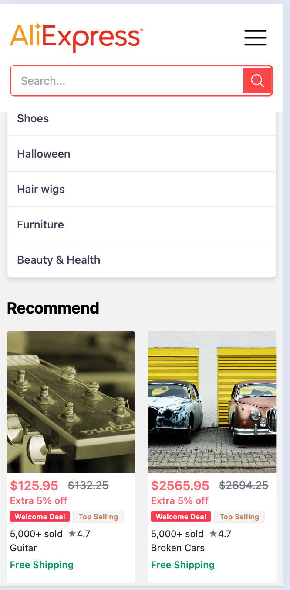

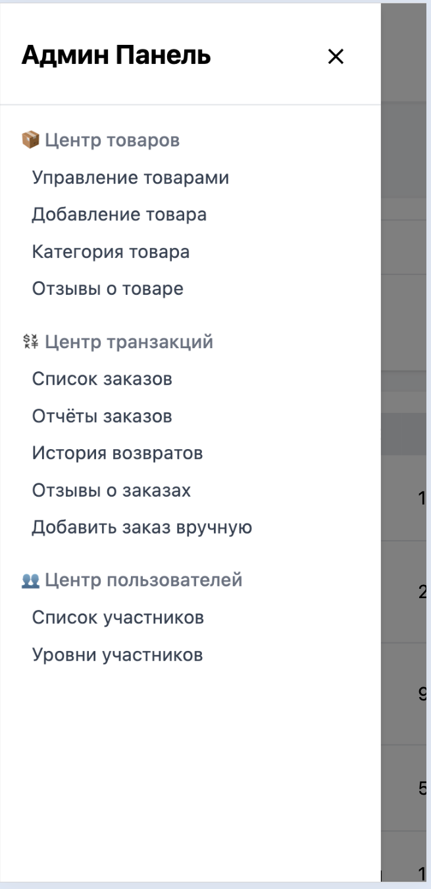

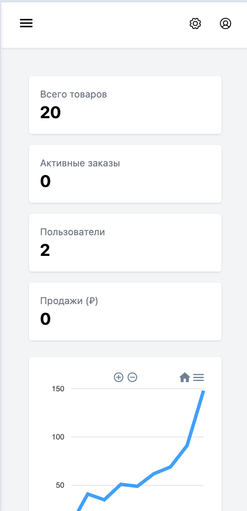